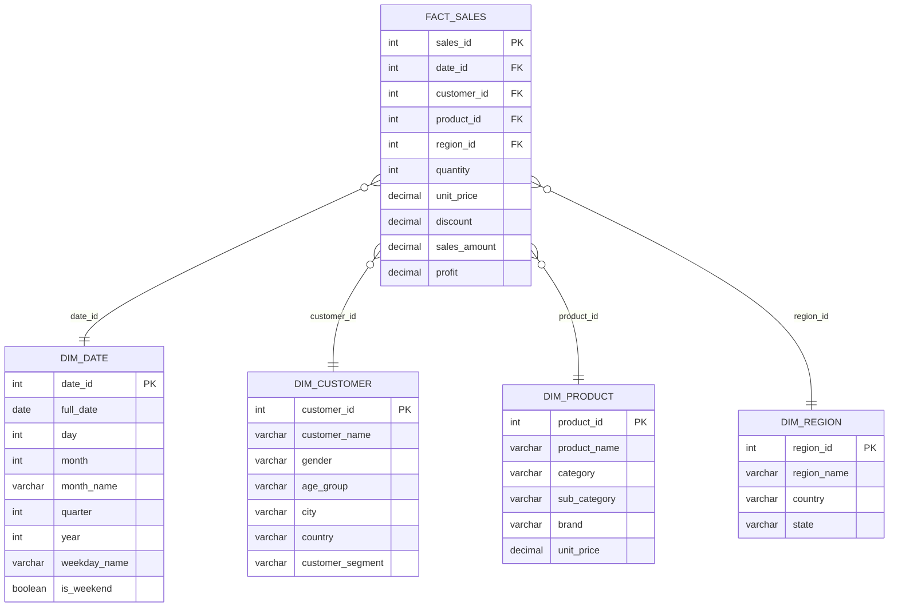

# Retail Sales Data Warehouse — Dimensional Modelling Project

A dimensional data warehouse built for a retail sales scenario, implemented in MySQL.
The project demonstrates star schema design, a normalized snowflake variant, and
analytical (BI-style) SQL querying — including joins, aggregation, CTEs, and window
functions.

Built to apply concepts from the *Advanced Database Management Systems* module
(data warehousing, dimensional modelling, OLTP vs OLAP, normalization) to a working
implementation rather than theory alone.

## Tech Stack
- MySQL 8.0
- SQL (DDL, DML, analytical queries)

## Project Structure
```
dwh-project/
├── README.md
└── sql/
    ├── 01_schema_star.sql          -- Star schema: fact + dimension tables
    ├── 02_schema_snowflake.sql     -- Snowflake variant (normalized DIM_PRODUCT)
    ├── 03_sample_data.sql          -- Sample data (20 dates, 10 customers,
    │                                   10 products, 5 regions, 45 sales records)
    └── 04_analytical_queries.sql   -- 7 analytical / BI queries
```

## Schema Design — Star Schema

`fact_sales` sits at the center, with one row per sales line item, connected to four
dimension tables via foreign keys.



## Star vs. Snowflake

`01_schema_star.sql` keeps `category` and `sub_category` as flat text columns inside
`dim_product` — denormalized, but fast and simple to query (typical for OLAP/BI
workloads).

`02_schema_snowflake.sql` normalizes this further by splitting category information
into its own `dim_category` table, referenced from `dim_product_snowflake` via
`category_id`. This removes redundancy but adds an extra join for every category-level
query — the classic star-vs-snowflake trade-off.

## How to Run

```bash
# 1. Create the database and star schema
mysql -u root -p < sql/01_schema_star.sql

# 2. Load sample data
mysql -u root -p < sql/03_sample_data.sql

# 3. (Optional) Create the normalized snowflake variant
mysql -u root -p < sql/02_schema_snowflake.sql

# 4. Run the analytical queries
mysql -u root -p < sql/04_analytical_queries.sql
```

All scripts have been tested end-to-end against MySQL 8.0.

## Analytical Queries Included (`04_analytical_queries.sql`)

1. Total sales revenue by region and month
2. Top 5 products by total revenue
3. Quarter-over-quarter revenue growth (`LAG()` window function)
4. Customer segment performance (average order value, total spend)
5. Running total of daily sales (`SUM() OVER`)
6. Region with the highest profit margin
7. Product ranking within each category (`RANK()` window function)

## Key Concepts Demonstrated
- Star schema vs. snowflake schema design
- Fact and dimension tables, grain definition
- Surrogate keys and foreign key relationships
- Normalization (in the snowflake variant)
- Indexing on foreign keys for join performance
- Analytical SQL: multi-table joins, `GROUP BY`, CTEs, window functions (`LAG`, `RANK`, running totals)

## Author
**Sithmaka Malawige**
[github.com/Sithmaka-Malawige](https://github.com/Sithmaka-Malawige) ·
[linkedin.com/in/sithmaka-malawige](https://linkedin.com/in/sithmaka-malawige)
